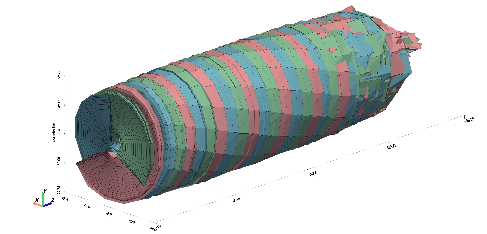
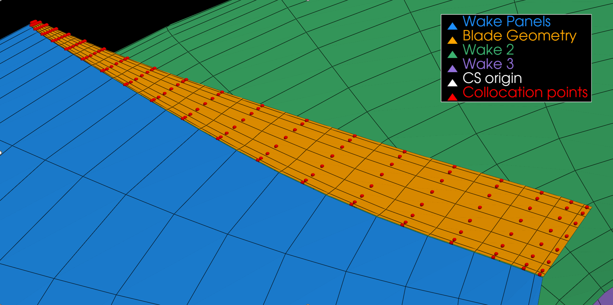
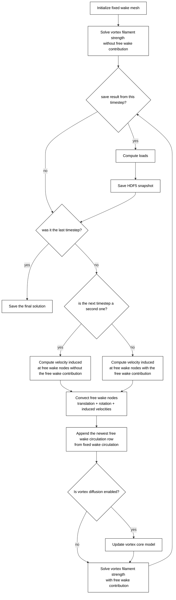
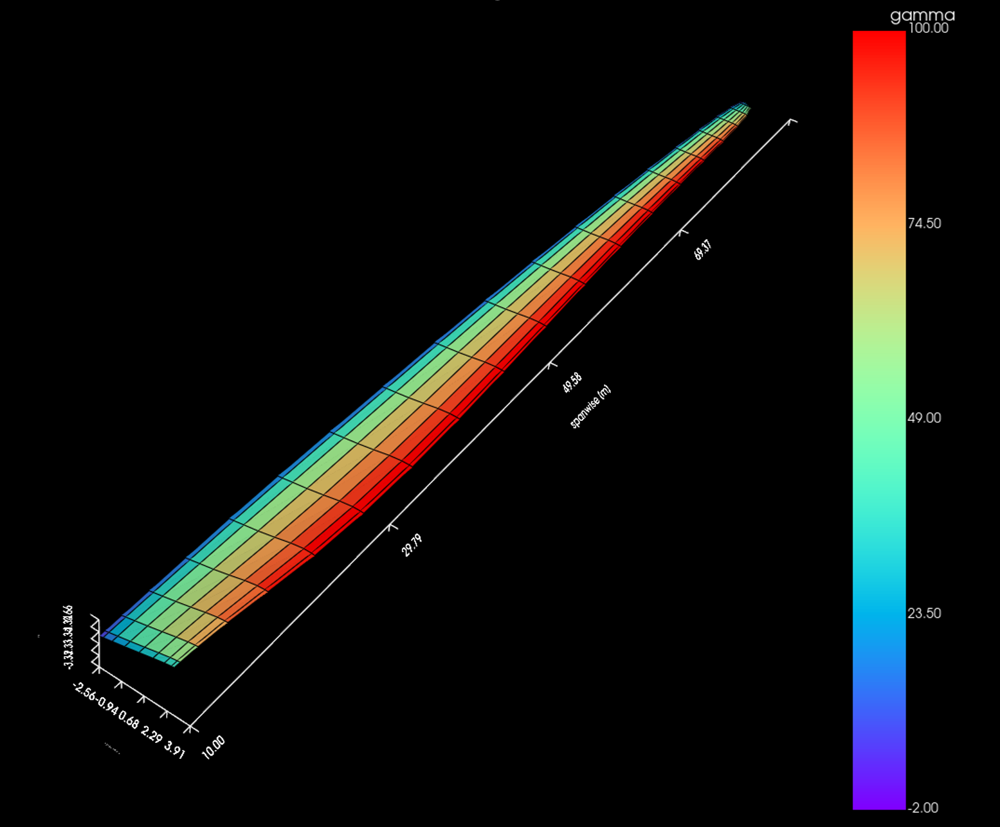
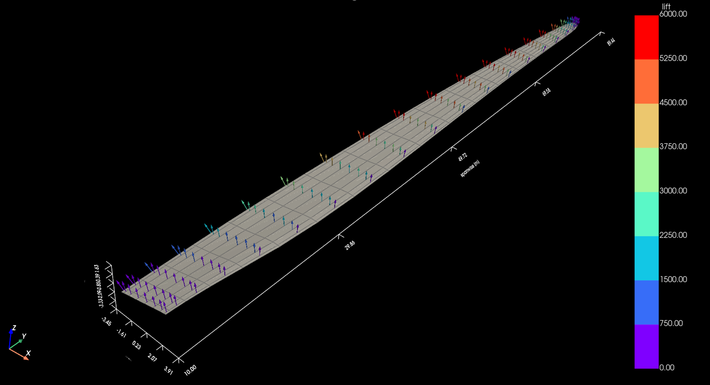
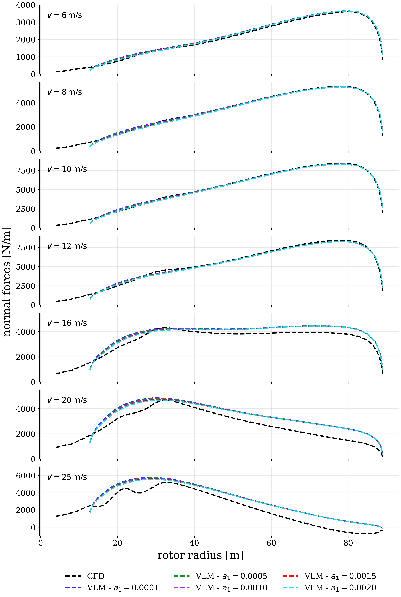
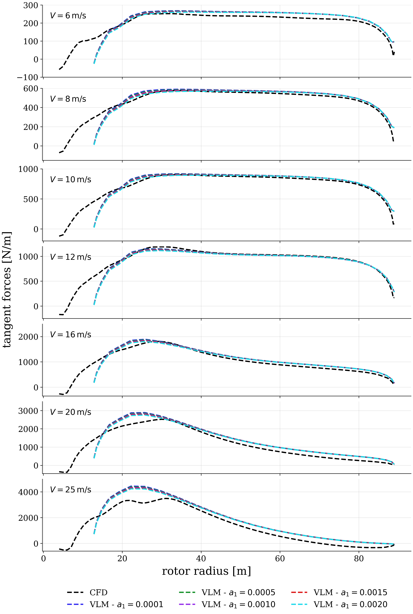

# Vortex Lattice Method — Free Wake Solver

Free wake vortex lattice solver for wake convection and blade load
evaluation on wind turbine rotors. Developed as part of my MSc thesis, completed under a double degree programme
in Aerospace Engineering (TU Delft) and Wind Energy (DTU),
[Full thesis](https://repository.tudelft.nl/record/uuid:5809471d-945e-4ebb-863e-05479aff4fcb).


*Free wake with 12 m/s wind speed, 0.05s fixed mesh timestep, 0.4s free mesh timestep and 60s physical simulation
time (DTU 10MW).*

## Overview

The solver implements the classical **Vortex Lattice Method** (Katz & Plotkin, 2010),
extended with:

- **Vortex laminar core models** — Vatistas et al. (1991)
- **Vortex core diffusion** — Ananthan & Leishman (2004), Squire's hypothesis (1965)
- **Viscous drag correction** — polar-based coefficient interpolation (private communication, M. Gaunaa, DTU Wind Energy)


*Collocation point locations on the example blade and wake geometry (DTU 10MW).*


## Usage

The workflow consists of three steps: building vortex grid, running the solver, and
visualizing the results.

### Build the geometry and run the solver

```python
from run_scripts import preprocessor, solver
import numpy as np

fixed_vortex_grid, aerodynamic_blade = preprocessor(
    xlsx_path="blade_input/blade.xlsx",
    wing_mesh_density=(10, 24),        # (chordwise, spanwise) resolution
    pitch_angle=-np.deg2rad(0),   
    wind_velocity=10,
    angular_velocity=8.029 * np.pi / 30,
    coordinate_system_origin=np.array([0, 0, 0]),
    cut_off_thickness=80,
    cosine_spacing=(True, True),
    timestep=0.05,
)

solution = solver(
    fixed_vortex_grid=fixed_vortex_grid,
    wind_velocity=10,
    air_density=1.225,
    angular_velocity=8.029 * np.pi / 30,
    blade_number=3,
    simulation_name="my_run",
    timestep=0.4,
    number_of_timesteps=150,
)
```

See `run_scripts/run_preprocessor.py` and `run_scripts/run_solver.py` for the full parameter
list (viscous drag polars, vortex core models, wake diffusion settings), and `main.py` for a
parametric sweep example across multiple operating points.

Each run saves `.h5` snapshot files to the simulation folder, one per saved timestep, a final
solution file, and a timing report (`*_computation_time.csv`).

### Visualize the results

```bash
python view_results.py --file results/{final_results}.h5
```

Loads a result with `PostProcessor` and visualize the free wake geometry, circulation
strength, force vector, and spanwise load distribution plots shown above. See
`postprocessor.py` for the full set of available plots and derived quantities
(`thrust_per_blade()`, `get_CP()`, `get_CT()`).


## Solver logic


## Convergence and sensitivity study

The solver's numerical convergence (timestep size, wake length, fixed vortex grid timestep size) is assessed in detail in Chapter 4 of the thesis linked above.

## Validation

Validated against the **DTU 10MW Reference Wind Turbine**:
[DTU repository](https://gitlab.windenergy.dtu.dk/rwts/dtu-10mw-rwt).

The free wake solver is able to get the accuracy of within 5% coefficient error respect to the CFD reference results
for the small pitch cases.
The example results are presented below for more check the Chapter 5 of the thesis linked above.

**Table: Comparison of free wake solver (Vatistas laminar vortex core model, n = 2, viscous drag correction, initial relative vortex core size = 1.4%, diffusion parameter $a_1 = 0.0005$) performance coefficients against CFD reference data.**

| $V_0$ [m/s] | $C_{P,ref}$ | $C_{P,new}$ | $\Delta C_P$ [%] | $C_{T,ref}$ | $C_{T,new}$ | $\Delta C_T$ [%] |
|:-----------:|:-----------:|:-----------:|:-----------------:|:-----------:|:-----------:|:-----------------:|
| 6           | 0.477       | 0.520       | 9.00               | 0.924       | 0.921       | −0.33              |
| 8           | 0.496       | 0.513       | 3.45               | 0.840       | 0.812       | −3.32              |
| 10          | 0.497       | 0.510       | 2.66               | 0.842       | 0.810       | −3.74              |
| 12          | 0.425       | 0.410       | −3.53              | 0.603       | 0.568       | −5.80              |
| 16          | 0.175       | 0.182       | 4.00               | 0.219       | 0.223       | 1.71               |
| 20          | 0.088       | 0.102       | 16.24              | 0.113       | 0.124       | 9.72               |
| 25          | 0.043       | 0.059       | 37.78              | 0.061       | 0.073       | 19.85              |


*Vortex ring circulation strength distribution across the rotor blade.*


*Lift forces distribution across the rotor blade.*

## Limitations

No stall modelling, accuracy decreases at highly pitched blade conditions, what is perceived as the biggest
limitation of the presented solver.

The future improvement could also include the turbulent vatistas core models, vortex filament stretching effect
and different wake convection schemes.  

## Selected results

**Figures: Comparison of free wake solver Vatistas laminar vortex core model, n = 1, viscous drag correction, and viscous core diffusion:
spanwise distribution of the normal and tangent force for an initial local core relative size of 0.014 and different core diffusion parameter
values $a1$.**




## References

1. Joseph Katz and Allen Plotkin. *Low–speed aerodynamics*, Ch. 12. 10th printing, New York, USA: Cambridge University Press, 2010.
2. G. H. Vatistas, V. Kozel, and W. C. Mih. “A simpler model for concentrated vortices”. In: *Experiments in Fluids* 11.1 (1991), pp. 73–76. DOI: 10.1007/bf00198434.
3. S. Ananthan and J. G. Leishman. “Role of Filament Strain in the Free-Vortex Modeling of Rotor Wakes”. In: *Journal of the American Helicopter Society* 49.2 (2004), pp. 176–91. DOI: 10.4050/jahs.49.176.
4. H. B. Squire. “The Growth of a Vortex in Turbulent Flow”. In: *Aeronautical Quarterly* 16.3 (1965), pp. 302–06.
5. C. Bak et al. “Description of the DTU 10 MW Reference Wind Turbine”. In: DTU Wind Energy (2013).